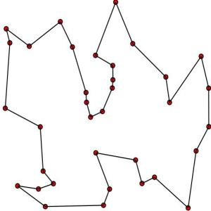

# 绪论

## 为什么要学数据结构？

- 数据结构是计算机科学的重要基础课程之一
- 数据结构是计算机考研必考科目
  - 全国计算机统考标准408包括：数据结构、计算机组成原理、计算机网络、操作系统
  - 工大计算机考研标准808只考数据结构
- 数据结构是算法竞赛考察的进阶内容

## 数据结构是什么？

**程序 = 数据结构 + 算法。**

**数据结构 = 数据 + 结构。**

完全无法理解这个答案？没有关系。
本门课程将由这两个公式开始，也由这个两个公式结束。
你所需要做的是带着对这个问题疑问，在后面的章节不断探索，最终理解这一概念。

解释抽象概念有两种方法，一种是高度凝练，另一种是巨细无遗。
我们在绪论中首先给出前者，在绪论外的章节实践后者。

## 算法分析

**程序 = 数据结构 + 算法。**
数据结构和算法是密不可分的，在研究这两者时有是先设计出了数据结构再找到了它的算法应用，有时是先设计了算法再为算法寻找需要的数据结构。
因此在学习数据结构的时候，我们不能把它剥离出来单独理解，而是必须配合着算法一同学习。
而从算法分析入手就是一个较好的选择。

### 算法复杂度

评级一个人可以从多个角度入手，他的成就，个人事迹，他人对他的评价等等。
评价一个算法同样如此，而其中一个最重要的角度是算法复杂度。
算法复杂度包括时间复杂度和空间复杂度，这两者绝大多数情况下是鱼与熊掌的关系。
所谓算法分析也就是去思考什么时候该吃鱼，什么时候该吃熊掌。

#### 时间复杂度

算法用时随数据规模而增长的趋势，即**时间复杂度**。

##### 大 $O$ 表示法


假设算法的问题规模为n，那么输入的数据规模可以用函数 $f(n)$ 来表示。

随着数据规模n的增大，算法执行时间的增长率和 $f(n)$ 的增长率相同，这称作为算法的渐近时间复杂度，简称时间复杂度，记为 $O(f(n))$。

算法导论给出的解释：大 $O$ 用来表示上界的，当用它作为算法的最坏情况运行时间的上界，就是对任意数据输入的运行时间的上界。

>此小节侧重实用性，不作严谨的说明。
>详细内容可参考[OI-Wiki](https://oi-wiki.org/basic/complexity/)上的讲解

##### 常数级

与问题的大小无关（n的多少），执行时间恒定的算法，我们称之为具有$O(1)$的时间复杂度，又叫常数阶。

```
#include <iostream>
using namespace std;
int main()
{
    int a, b;
    cin >> a >> b;
    cout << a + b ;
    return 0;
}
```
上述的代码的时间复杂度为常数级。
***
##### 线性级
线性阶的循环结构会复杂很多。要确定某个算法的阶次，我们常常需要确定某个特定语句或某个语句集运行的次数。

因此，我们要分析算法的复杂度，关键就是要分析循环结构的运行情况。

下面这段代码，它的循环的时间复杂度为$O(n)$，因为循环体中的代码须要执行n次。
```
for (int i = 0; i < n; i++)

{   

 /* 时间复杂度为O(1)的程序步骤序列 */

}
```
***
##### 对数级

快速排序（一般归为对数级，实际上可以取经于幂级）
```
int a[]; 
void sort(int a[], int l, int r){
  if(l == r) return ;

  int mid = a[(l + r) >> 1], i = l - 1, j = r + 1;
	while (i < j)
	{
		do i++; while (mid > a[i]);
		do j--; while (mid < a[j]);
		if (i < j) swap(a[i], a[j]);
	}

  sort(l, j);
  sort(j + 1, r);
}
```
每次进行$sort()$操作时都会将数组$a[n]$分为两段，直到不能分为止。  
由于每次$a[n]$长度除以2之后，就距离1更近了一分。
也就是说，有多少个2相除后小于等于1，则会退出循环。
由$2^x=n$得到$x=log_2 n$。所以这个循环的时间复杂度为$O(logn)$。
***

##### 幂级
幂级常见于循环的嵌套中。
```
for(int i = 0; i < n; i ++){
  for(int j = 0; j < n; j ++){
    //操作1
  }
  //操作2
}
```
该代码的时间复杂度为$O(n^2)$
***
##### 指数级

递归求解斐波那契数列
```
int fibonacci(int n){
  if(n <= 2) return 1;
  else return fibonacci(n - 1) + fibonacci(n - 2);
}
```
每当输入n增加1时，执行的操作数量就会翻倍。这是因为我们没有缓存每个函数调用的结果，所以必须从最开始重新计算所有先前的值。因此，该算法的时间复杂度为 $O(2ⁿ)$。
***
##### 阶乘级别
最后的类型是阶乘时间复杂度的算法。通常应避免这中复杂度，因为随着输入规模的增加，它们会很快变得难以运行。这种算法有一个示例，那就是**旅行推销员问题**的暴力解法。这个问题是希望找到一条最短路径，要求该路径必须访问坐标系中的所有点，并最终回到起点。暴力解法涉及相互比较所有可能的路线并选择最短的。请注意，除非要访问的点数很少，否则这通常不是解决此问题的合理方法。


***
#### 空间复杂度

桶排序

### 算法优化


## 算法思想

### 有哪些算法思想？

枚举/朴素/暴力、模拟、分治和递归、贪心、动态规划、回溯、排序、查找、搜索

### 算法思想与现实生活的联系

## 算法中的数据结构
